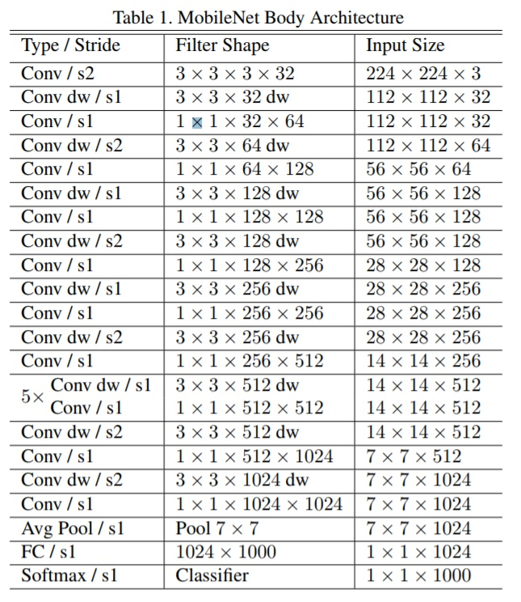

# NN

## MobileNet

### 将卷积操作替换为 Depthwise(group convolution) + Pointwise

计算量 (H,W,Ci,Co,k=3):  

Conv: $H * W * Ci * Co * k * k$  

Depthwise: $H * W * k * k * Ci$  

Pointwise: $H * W * Ci * Co$  

将普通卷积的计算量压缩为:  

$$
\frac{depthwise + pointwise}{conv} = \frac{H * W * k * k * Ci + H * W * Ci * Co}{H * W * Ci * Co * k * k} = \frac{1}{Co} + \frac{1}{k*k}
$$

### Kernel 数量乘以缩小因子 a，以压缩总计算量

## reference  

轻量化网络ShuffleNet MobileNet v1/v2 解析  
<https://zhuanlan.zhihu.com/p/35405071>  
